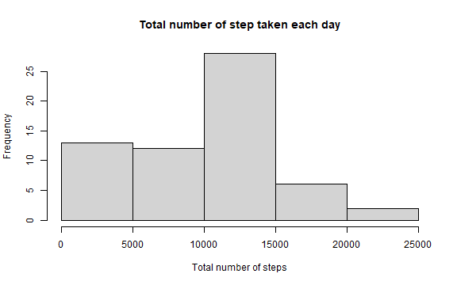
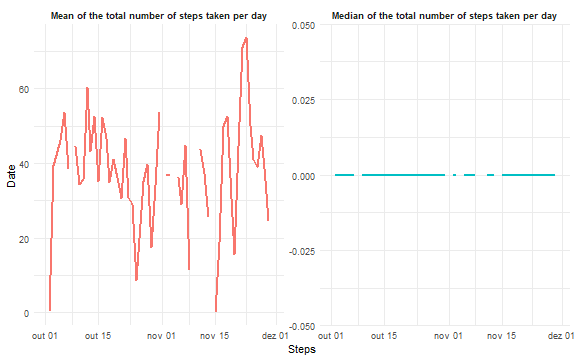
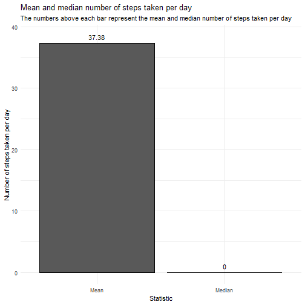
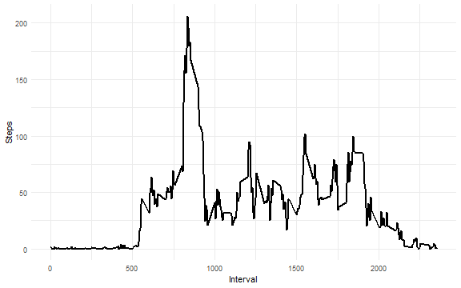
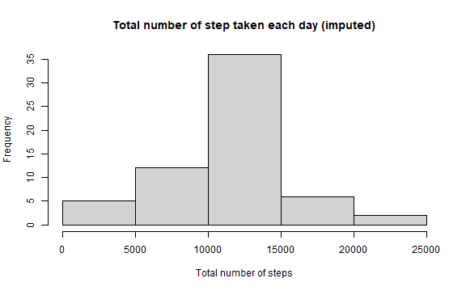
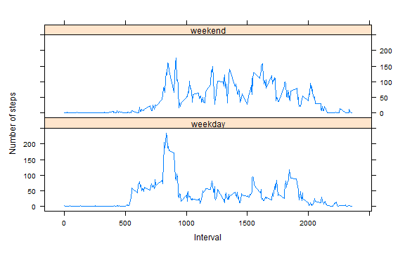

## Loading and preprocessing the data

Loading the packages to analyze the data.


```r
# loading packages
library(tidyverse)
library(lattice)
library(fs)
```

Creating temporary folder to store the figures.


```r
dir_create(path = 'figures/')
```

Loading the dataset.


```r
# loading the data
df <- read_csv(file = 'activity.csv')
df
```

```
## # A tibble: 17,568 x 3
##    steps date       interval
##    <dbl> <date>        <dbl>
##  1    NA 2012-10-01        0
##  2    NA 2012-10-01        5
##  3    NA 2012-10-01       10
##  4    NA 2012-10-01       15
##  5    NA 2012-10-01       20
##  6    NA 2012-10-01       25
##  7    NA 2012-10-01       30
##  8    NA 2012-10-01       35
##  9    NA 2012-10-01       40
## 10    NA 2012-10-01       45
## # ... with 17,558 more rows
```

## What is mean total number of steps taken per day?

1. Calculate the total number of steps taken per day


```r
df %>% 
  group_by(date) %>% 
  summarise(total_steps = sum(steps, na.rm = TRUE))
```

```
## # A tibble: 61 x 2
##    date       total_steps
##    <date>           <dbl>
##  1 2012-10-01           0
##  2 2012-10-02         126
##  3 2012-10-03       11352
##  4 2012-10-04       12116
##  5 2012-10-05       13294
##  6 2012-10-06       15420
##  7 2012-10-07       11015
##  8 2012-10-08           0
##  9 2012-10-09       12811
## 10 2012-10-10        9900
## # ... with 51 more rows
```

2. Make a histogram of the total number of steps taken each day


```r
df %>% 
  group_by(date) %>% 
  summarise(total_steps = sum(steps, na.rm = TRUE)) %>% 
  pull(total_steps) %>% 
  hist(x = ., main = 'Total number of step taken each day', xlab = 'Total number of steps')
```



3. Calculate and report the mean and median of the total number of steps taken per day

For each day.


```r
df %>% 
  group_by(date) %>% 
  summarise(
    'Mean of the total number of steps taken per day'   = mean(steps, na.rm = TRUE),
    'Median of the total number of steps taken per day'  = median(steps, na.rm = TRUE)
  ) %>% 
  pivot_longer(cols = -date, names_to = 'variable', values_to = 'values') %>% 
  ggplot(mapping = aes(x = date, y = values, color = variable)) +
  facet_wrap(~ variable, ncol = 2, scales = 'free_y') +
  geom_line(size = 1, show.legend = FALSE) +
  labs(x = 'Steps', y = 'Date') +
  theme_minimal() +
  theme(strip.text = element_text(face = 'bold'))
```



Across all days.


```r
df %>% 
  summarise(
    'Mean'    = mean(steps, na.rm = TRUE),
    'Median'  = median(steps, na.rm = TRUE)
  ) %>% 
  pivot_longer(cols = everything(), names_to = 'variable', values_to = 'values') %>% 
  ggplot(mapping = aes(x = variable, y = values)) +
  geom_col(color = 'black') +
  geom_text(mapping = aes(label = round(values, digits = 2)), nudge_y = 1) +
  theme_minimal() +
  labs(
    title    = 'Mean and median number of steps taken per day',
    subtitle = 'The numbers above each bar represent the mean and median number of steps taken per day',
    x        = 'Statistic',
    y        = 'Number of steps taken per day'
  )
```




## What is the average daily activity pattern?

1. Make a time series plot of the 5-minute interval (x-axis) and the average number of steps taken, averaged across all days (y-axis)


```r
df %>% 
  group_by(interval) %>% 
  summarise(
    mean_steps   = mean(steps, na.rm = TRUE)
  ) %>% 
  ggplot(mapping = aes(x = interval, y = mean_steps)) +
  geom_line(size = 1) +
  labs(x = 'Interval', y = 'Steps') +
  theme_minimal()
```



2. Which 5-minute interval, on average across all the days in the dataset, contains the maximum number of steps?

Interval 835.


```r
df %>% 
  group_by(interval) %>% 
  summarise(
    mean_steps   = mean(steps, na.rm = TRUE)
  ) %>% 
  slice_max(n = 1, order_by = mean_steps)
```

```
## # A tibble: 1 x 2
##   interval mean_steps
##      <dbl>      <dbl>
## 1      835       206.
```

## Imputing missing values


1. Calculate and report the total number of missing values in the dataset

The total number of missing values per column is shown below.


```r
df %>% 
  is.na() %>% 
  colSums
```

```
##    steps     date interval 
##     2304        0        0
```

2. Devise a strategy for filling in all of the missing values in the dataset

Inputting the mean values for missing data.


```r
df %>% 
  group_by(interval) %>% 
  mutate(steps = ifelse(test = is.na(steps), 
                        yes = round(x = mean(steps, na.rm = TRUE), digits = 0), no = steps))
```

```
## # A tibble: 17,568 x 3
## # Groups:   interval [288]
##    steps date       interval
##    <dbl> <date>        <dbl>
##  1     2 2012-10-01        0
##  2     0 2012-10-01        5
##  3     0 2012-10-01       10
##  4     0 2012-10-01       15
##  5     0 2012-10-01       20
##  6     2 2012-10-01       25
##  7     1 2012-10-01       30
##  8     1 2012-10-01       35
##  9     0 2012-10-01       40
## 10     1 2012-10-01       45
## # ... with 17,558 more rows
```

3. Create a new dataset that is equal to the original dataset but with the missing data filled in

Creating a new dataset with inputed data.


```r
df_imputed <- df %>% 
  group_by(interval) %>% 
  mutate(steps = ifelse(test = is.na(steps), 
                        yes = round(x = mean(steps, na.rm = TRUE), digits = 0), no = steps)) %>% 
  ungroup
df_imputed
```

```
## # A tibble: 17,568 x 3
##    steps date       interval
##    <dbl> <date>        <dbl>
##  1     2 2012-10-01        0
##  2     0 2012-10-01        5
##  3     0 2012-10-01       10
##  4     0 2012-10-01       15
##  5     0 2012-10-01       20
##  6     2 2012-10-01       25
##  7     1 2012-10-01       30
##  8     1 2012-10-01       35
##  9     0 2012-10-01       40
## 10     1 2012-10-01       45
## # ... with 17,558 more rows
```

4. Make a histogram of the total number of steps taken each day and calculate and report the mean and median total number of steps taken per day.

Histogram of the total number of steps taken each day using the inputed data.


```r
df_imputed %>% 
  group_by(date) %>% 
  summarise(total_steps = sum(steps, na.rm = TRUE)) %>% 
  pull(total_steps) %>% 
  hist(x = ., main = 'Total number of step taken each day (imputed)', xlab = 'Total number of steps')
```



Mean and median total number of steps taken per day using the inputed data.


```r
df_imputed %>% 
  summarise(
    'Mean'    = mean(steps, na.rm = TRUE),
    'Median'  = median(steps, na.rm = TRUE)
  ) %>% 
  pivot_longer(cols = everything(), names_to = 'variable', values_to = 'values') %>% 
  ggplot(mapping = aes(x = variable, y = values)) +
  geom_col(color = 'black') +
  geom_text(mapping = aes(label = round(values, digits = 2)), nudge_y = 1) +
  theme_minimal() +
  labs(
    title    = 'Mean and median number of steps taken per day',
    subtitle = 'The numbers above each bar represent the mean and median number of steps taken per day',
    x        = 'Statistic',
    y        = 'Number of steps taken per day'
  )
```


a. Do these values differ from the estimates from the first part of the assignment?

The total number of steps taken each day differs, but not the mean and median.

b. What is the impact of imputing missing data on the estimates of the total daily number of steps?

Data on the total number of steps taken each day became more normally distributed, with much more observations towards 10K to 15K steps. Mean and median steps did not differ.

## Are there differences in activity patterns between weekdays and weekends?

1. Create a new factor variable in the dataset with two levels – “weekday” and “weekend” indicating whether a given date is a weekday or weekend day


```r
df <- df %>% 
  mutate(
    wweek = weekdays(date),
    wweek = case_when(wweek %in% c('sábado', 'domingo') ~ 'weekend',
                      TRUE ~ 'weekday')
  )
df
```

```
## # A tibble: 17,568 x 4
##    steps date       interval wweek  
##    <dbl> <date>        <dbl> <chr>  
##  1    NA 2012-10-01        0 weekday
##  2    NA 2012-10-01        5 weekday
##  3    NA 2012-10-01       10 weekday
##  4    NA 2012-10-01       15 weekday
##  5    NA 2012-10-01       20 weekday
##  6    NA 2012-10-01       25 weekday
##  7    NA 2012-10-01       30 weekday
##  8    NA 2012-10-01       35 weekday
##  9    NA 2012-10-01       40 weekday
## 10    NA 2012-10-01       45 weekday
## # ... with 17,558 more rows
```

2. Make a panel plot containing a time series plot of the 5-minute interval (x-axis) and the average number of steps taken, averaged across all weekday days or weekend days (y-axis).


```r
## summarizing the data
df_to_plot <- df %>% 
  group_by(interval, wweek) %>% 
  summarise(
    mean_steps = mean(steps, na.rm = TRUE),
    .groups = 'drop'
  ) 

## creating the plot
xyplot(mean_steps ~ interval | wweek, data = df_to_plot, type = 'l', ylab = 'Number of steps', xlab = 'Interval', layout = c(1, 2))
```


